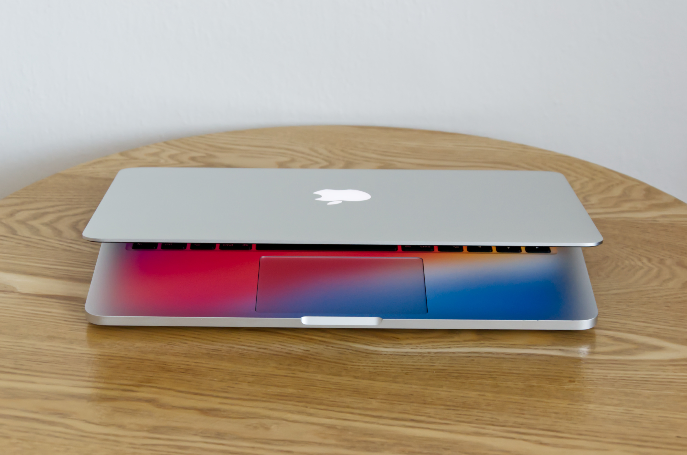
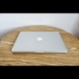
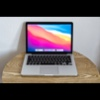
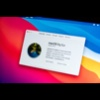

# Macbook Pro, Retina 13-inch, Early 2015

Jelikož jsem switchnul na M1, leží mi tady doma nevyužitý můj původní pracant MB Pro 2015 s 2.7 GHz Intel i5, 8GB RAM a 128 GB nebo 1 TB SSD, který prodávám i s bezdrátovou klávesnicí, trackpadem a párem užitečných dongles.

## Specifikace

- 13-inch Early 2015
- 2.7 GHz Dual-Core Intel Core i5
- 8 GB 1867 MHz DDR3
- Intel GPU 6100, 1536 MB VRAM
- 128 GB Apple orig. Samsung SSD _nebo_ 1 TB SSD Samsung 970 EVO+
  - Pro disk případně mám využití, tak ho nedávám ve výchozím stavu, viz. poznámka u ceny

## Co je included

- Macbook
- OEM Magsafe nabíječka
- Magic Keyboard (wireless, 1st gen)
- Magic Trackpad (wireless, 1st gen)
- Ethernet Dongle
- VGA Dongle
- Thunderbolt↔DisplayPort kabel pro připojení monitoru (není na fotce)
- M.2 SSD Konvertor
  - Umožní zasadit libovolný M.2 SSD disk do proprietárního Apple SSD slotu, takže jde vyměnit disk za jiný který nemusí být koupený od Apple
- V krabici

## Fotky

## Stav

- koupený **2016**
- vizuálně **skvělý** stav
- baterie **751 cyklů**
  - nafouklá a potřebuje vyměnit
- displej **2018**
  - minimální známky používání

Zakoupen v roce 2016, používán denně, nošený vždy v obalu, dobře opečovávaný. Displej je dokonce novější, v roce 2018 jsem využil bezplatnou výměnu kvůli tehdejším problémům se slejzající antireflexní vrstvou (to se po výměně už naštěstí nedělo).

Vzhledem k tomu kolik jsem viděl cizích Macbooků po 5+ letech používání, a viděl jsem ostatní inzeráty 2015 Macbooků který vypadaj jako by je přejelo auto, tak vizuálně se neostýchám to označit za **skvělý stav**. Je stále reprezentativní a vypadá dobře. Pár malinkých šťouchanců má, vše je vyfocené. Ošoupaný jsou pouze nožičky zespod.

Hardware je bez vad až na baterii, ta se bohužel stihla nafouknout a bude potřebovat vyměnit. Tenhle fakt je promítnutý do ceny, viz poznámka níže.

Na SSD je nainstalovaný macOS Big Sur, ale Monterey je pro Early 2015 stále dostupný, stačí updatnout.

## K čemu je to dobrý

Pro hardcore náročný vývoj hladových aplikací, rozběhávání simulátorů a emulátorů (jako je iOS vývoj nebo práce s Dockerem) je to už stařeček a už to není moc příjemný (pořád doable ale chce to trpělivost).

Ale třeba taková práce s kancelářským software, méně náročný vývoj, e-maily, browsing, filmy atd., pro tyhle věci to bude spolehlivý stroj.

## Cena

**7900 Kč**

Pro 1TB disk mám využití, takže cena je s 128GB originálním diskem. Stál 3k, za 1900 Kč k ceně ho tam nechám.

Ta klávesnice a trackpad je tam víceméně gratis. Pokud víte, že ji nevyužijete nebo nechcete tak vám je cpát nebudu, ale s cenou to tolik nepohne.

Pokud se vám ta baterka moc nezdá, tak můžete počkat než mi dojde trpělivost pokud o to za tuhle cenu nebude zájem. Pak hodlám baterku vyměnit za fresh novou a pustit to asi za devět a půl.

## Předání a kontakt

Pouze osobní předání v Praze, je silně nepravděpodobné že bych to někam posílal, ale můžete mě zkusit přesvědčit.

Snažil jsem se to vyfotit a popsat co nejdetailněji to šlo, proto nebudu úplně šťastný pokud se na to budete "jen chtít podívat", budu preferovat vážné zájemce.

+420 605 347 542  
[mbpro@marianhlavac.cz](mailto:mbpro@marianhlavac.cz)
